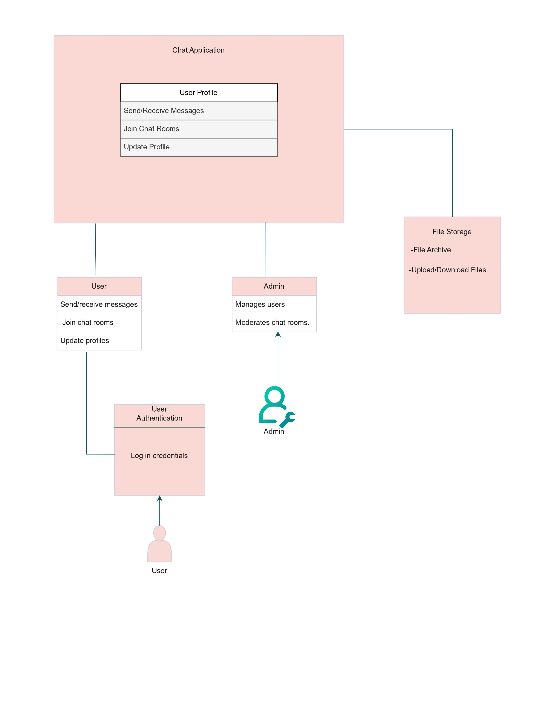

# Online-Chat-Application

## Product Vision Statement:

For users who want to communicate with their peers in private or group chats. The Online-Chat-Application is a web application that allows users to communicate with eachother directly and or a group chat that will allow the users to send text or picture images, and it will also have the ability to send friend requests to other users, share personal information about themselves on their profiles, and add a customized image for their profile that will give the users more customizability which will result in better user experience. Unlike other similar products on the market, our product offers the same functionality but we aim to add features that give more customizable options that act similar to a social media platform to enhance the user's experience.

